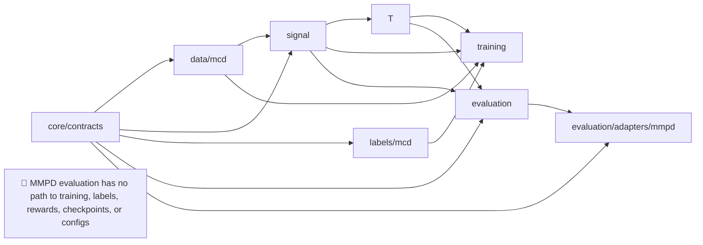

# System design

## Purpose and boundary

This system learns only where a classical remote photoplethysmography (rPPG) extractor should look. It does not learn pixels-to-pulse end to end. The deployable path consumes video-derived ROI measurements and prior controller state; it never consumes ground truth (GT), dataset labels, subject IDs, or condition labels.

The first implementation target is historical schema-v3 parity on MCD, followed by a separately approved causal-missing-data refinement. Historical results remain frozen evidence and are not silently reinterpreted.

## Architecture and dependency law

The packages and one-way dependencies are:

1. `core/contracts`: dataset-neutral immutable types, enums, validators, hashes, and errors. It imports nothing project-specific.
2. `data/mcd`: MCD-only raw discovery, manifest validation, and subject-disjoint split loading. Gate 2 publishes source and dataset manifests only; canonical frame emission is a later gate.
3. `signal`: causal POS/HR measurement construction from canonical frames. It cannot import labels, training, evaluation adapters, or dataset-specific modules.
4. `labels/mcd`: centered GT HR labels and GT-informed teacher artifacts for MCD training/evaluation only. Deployable inference modules cannot import it.
5. `control`: belief update, observation construction, action legality, and environment transition. Reward calculation receives labels only through a training-only adapter.
6. `training`: MCD-only behavior cloning, DAgger, and PPO. It imports `data/mcd`, `labels/mcd`, `signal`, and `control`, and rejects non-MCD manifests.
7. `evaluation`: frozen replay, metrics, uncertainty, output manifests, and comparison arms. It cannot modify checkpoints or training configs.
8. `evaluation/adapters/mmpd`: MMPD-only frozen evaluation adapter. It may import dataset-neutral contracts and frozen evaluation interfaces, but no training or model-selection interface may import it.

The boundary is mechanically enforced later with import-closure tests and CLI namespace separation. Training commands accept only an `MCDTrainingManifest`. The MMPD adapter emits an `EvaluationDatasetManifest`, a distinct type with no conversion method to the training type.

🚫 No edge may carry MMPD evaluation into training, labels, reward design, checkpoint selection, or configuration selection.

Before any MMPD rows are opened, seal a `FrozenEvaluationPlan` containing accepted checkpoint hashes, seed identities, comparison arms, signal/belief configurations, cohort, exclusions, metrics, aggregation, uncertainty procedure, and failure thresholds. The adapter accepts only this sealed plan and rejects changed checkpoints or configurations. Its plan ID and hash appear in every MMPD result row and run manifest. MCD priorities and selection rules are established independently; MMPD findings cannot create or prioritize MCD experiments.

## Runtime contracts

Schema ownership is in [data_contract.md](data_contract.md).

- `CanonicalFrame`: dataset ID, clip ID, frame index, timestamp, camera FPS, pose, 12 ordered ROI measurements, and provenance reference. No GT.
- `MeasurementFrame`: dataset ID, clip ID, hop index/time, 12 `ROIMeasurement` records, signal-config ID, and causal validity/provenance. No GT.
- `LabelFrame`: dataset ID, clip ID, hop index/time, GT HR, GT-rule ID, and validity. Kept separate from measurements.
- `BeliefState`: HR mean, HR velocity, 2x2 covariance, and hops since confident measurement.
- `ControllerObservation`: versioned 101-vector for the parity profile plus a named field map; never an unlabelled vector without schema metadata.
- `ActionDecision`: proposed action, executed action, previous action, hold count before/after, legality, and override reason.
- `ControlTransition`: dataset ID as provenance, observation schema, proposed/executed action, pre/post belief, selected measurement, and signal/control configuration IDs. It has no labels or reward fields; a later training adapter owns those joins.
- `RunManifest`: immutable input manifests, code commit, dependency versions, configs, seeds, checkpoint hashes, output hashes, and completion state.

## Historical schema-v3 parity profile

These are one named compatibility profile, not scattered defaults:

- 12 semantic ROIs in the exact action order in [data_contract.md](data_contract.md).
- Trailing 8-second signal window and 1-second hop.
- FullHDwebcam and USBVideo at 30 Hz; IriunWebcam at 24 Hz.
- Wang POS rolling normalization of 1.6 seconds.
- Causal one-pass POS post-filter: Butterworth order 1, 0.75-3.0 Hz.
- HR filter: Butterworth order 3, 0.5-3.0 Hz.
- Hann periodogram; HR NFFT `max(4096, next_power_of_two(n))`; peak-power ratio uses natural NFFT `n`.
- MCD GT rule `causal_periodogram_peak_no_subharmonic_v3`; MCD subharmonic correction disabled.
- Constant-velocity belief state `[HR, HR velocity]`, `dt=1`, initial HR 70, HR variance 400, velocity variance 25, confidence threshold 0.2.
- The authenticated frozen replay configuration, not Python constructor defaults, is authoritative for belief noise: `q=0.1`, `r0=200`, with `R=r0/max(confidence,1e-6)`.
- Prediction and scoring use the post-update belief mean.
- Minimum action hold 2; first action unrestricted.

Generic legacy constructor defaults (`q=2`, `r0=10`) differ from the frozen run and must not be copied as experiment truth.

## Observation, actions, and belief

The parity observation has 101 values. For each ROI, in canonical order, it stores seven values: `(hr-90)/40`, `(hr-belief_mean)/40`, confidence clipped to [0,1], peak-power ratio clipped to [0,1], coverage clipped to [0,1], fraction of other valid ROI HR values within 5 BPM, and valid flag. Belief contributes `(mean-90)/40`, `sqrt(max(var_hr,0))/40`, velocity/10, and `min(hops_since_confident,20)/20`. Control context contributes a 12-way previous executed-action one-hot and `min(hold_count,10)/10`.

When ROI HR is invalid, only the numeric HR slots may use the current belief mean; the valid flag remains false. Named pre-vector fields must be stored so this substitution is auditable.

The action space is discrete 12 in canonical order. The environment alone decides legality. Before the first action, `hold_count=0`; the first executed action is unrestricted and sets it to 1. The count is consecutive hops on the current executed action. A switch is legal only when the pre-action count is at least 2. An executed switch resets the post-action count to 1; staying increments it. Historical parity deterministically overrides an illegal early switch, and outputs store proposed and executed action plus override reason. A policy action mask is not the default and requires a separately named MCD-only experiment.

Belief update is predict-then-update. Non-finite HR or non-positive/non-finite confidence causes predict-only. `hops_since_confident` resets only at confidence >= 0.2; otherwise it increments. GT never affects belief state, and state resets at each clip boundary.

## Reward and training

Log every reward component separately.

- Standard PPO: `-abs(post_update_belief_mean - gt_hr) - switch_cost * executed_switch`, plus an uncertainty term only in an explicitly named ablation. The accepted baseline has switch cost 0.
- Advantage PPO: `baseline_abs_error - policy_abs_error + switch_cost * (baseline_switched - policy_switched)`, followed by the explicitly configured transform/scale. The confirmed active improvement came from advantage-over-base shaping. Hard clipping to [-10,+10] was a wash and is not a default.

DAgger is MCD-only: initial cross-entropy clone of the GT-informed offline Oracle-C sequence, then two self-rollout rounds. Visited MCD states are relabelled by the one-step GT-informed greedy level-B teacher, aggregated, and refit. Oracle-C and greedy-B are training teachers only and never deployable inputs.

PPO is online/on-policy and warm-started from its matching DAgger checkpoint. Standard and advantage PPO comparisons require matched substrate, initialization, rollout budget, seed set, environment, and evaluation ruler.

**Unknown:** the exact canonical legacy DAgger entrypoint was not located in this audit. No new DAgger implementation may begin until its sequence is reconstructed from artifacts or frozen as a new explicitly versioned protocol.

## Causality, failure behavior, and reproducibility

**Open risk:** the legacy substrate builder linearly interpolated each ROI's RGB over the complete clip before constructing trailing windows, so a missing value can use a future frame. Impact on past results is unknown.

No deployable or training measurement may depend on a future frame. Full-clip interpolation is prohibited. Missing-data configuration must declare causal past-only handling, `max_fill_age_frames` (not guessed), per-channel imputation flag and age, and invalid ROI behavior when no permitted past sample exists or age exceeds the bound. Non-finite raw inputs cannot be silently replaced by zero. The fill-age bound remains unresolved pending an MCD-only parity/impact audit and approval. A historical noncausal-fill reproducer, if retained, belongs only in a named diagnostic namespace and cannot support training or publication claims without an explicit limitation.

Fail closed for unknown ROI order, missing fields, hash mismatch, duplicate keys, non-monotonic time, FPS mismatch, split overlap, non-MCD training manifests, GT in inference input, illegal cached teacher sequences, incomplete manifests, or extra/missing checkpoint files. Write atomically: temporary file, validation, hash, then rename. Completed manifests are immutable. Resumption validates every completed shard rather than trusting file existence.

## Implementation order and gates

Gate 1 contracts and validators are complete. Gate 2 passed independent review and full-data MCD acceptance on Polaris job `46838`. Gate 3 passed independent review and real train-only MCD structural acceptance on Polaris job `46896`. Gate 4 passed independent review and real train-only MCD structural and failure-path acceptance on Polaris job `46927`. The implementation order remains fixed:

1. Contracts and validators.
2. MCD manifest/split adapter.
3. Causal signal builder with synthetic numeric tests.
4. Belief tracker and action legality.
5. Frozen evaluator and row-level outputs.
6. Historical parity replay on a small MCD fixture, then full MCD parity.
7. MCD-only training adapters.
8. MMPD frozen-evaluation adapter last.

No training is allowed until gates 1-6 pass. Acceptance gates are schema round-trip, no-GT inference import closure, MMPD-to-training import prohibition, synthetic HR accuracy, missing-data causality test, clip-reset test, proposed/executed action test, split leakage test, hash-tamper test, row aggregation test, and parity discrepancy report.
